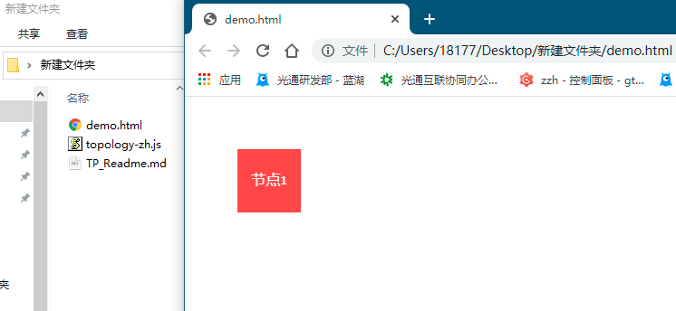
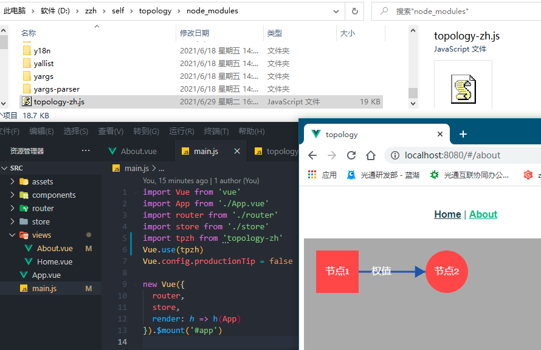
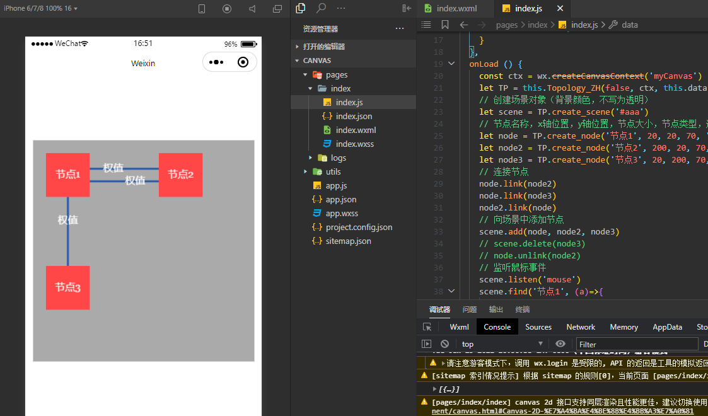

### Introduction

Topology-ZH is a library of singe file, to draw topology picture. It is open source, easy to use.

If you want to use it, you need download it and put it into your project files or codes.

### Installation

```
npm topology-zh
```

or

```html
<script src="zzh97.cc/lib/topology-zh.js"></script>
```

### Quick Start

```html
<canvas id="canvas"></canvas>

<script src="topology-zh.js"></script>
<script>
let canvas = document.getElementById('canvas')
let TP = Topology_ZH(canvas)
let scene = TP.create_scene()
let node = TP.create_node('节点1')
scene.add(node)
scene.render()
</script>
```



### Examples

```html
<canvas id="canvas"></canvas>
<script src="topology-zh.js"></script>
<script>
  let canvas = document.getElementById('canvas')
  let TP = Topology_ZH(canvas)
  // 创建场景对象（背景颜色，不写为透明）
  let scene = TP.create_scene('#aaa')
  // 节点名称，x轴位置，y轴位置，节点大小，路径权重,节点类型，连线类型，节点颜色，文本颜色，连线颜色
  let node = TP.create_node('节点1', 20, 20, 70, 'box', 'arrow')
  let node2 = TP.create_node('节点2', 200, 20, 70, 'round')
  // 连接节点
  node.link(node2, '权值')
  // 向场景中添加节点
  scene.add(node, node2)
  // 监听鼠标事件
  scene.listen('mouse')
  // 渲染
  let timer = scene.render ((el)=>{
    // 鼠标在节点上悬停时
    el.hover = function () {
      el.nodeColor = '#5a5'
    }
    // 鼠标不在节点上悬停时
    el.unhover = function () {
      el.nodeColor = '#e55'
    }
    // 鼠标点击节点时
    el.click = function () {
      console.log ('click')
    }
    // 鼠标拖拽节点时
    el.drag = function () {
      el.x = TP.mouseX - el.spaceX
      el.y = TP.mouseY - el.spaceY
    }
  }, 30) // 30是fps
</script>
```


### VUE-CLI

main.js

```javascript
import Vue from 'vue'
import App from './App.vue'
import router from './router'
import store from './store'
import tpzh from 'topology-zh'
Vue.use(tpzh)
Vue.config.productionTip = false

new Vue({
  router,
  store,
  render: h => h(App)
}).$mount('#app')
```

About.vue

```vue
<template>
  <div class="about">
    <canvas ref="canvas"></canvas>
  </div>
</template>

<script>
export default {
  data(){
    return {
      timer: Object,
    }
  },
  mounted () {
    let canvas = this.$refs.canvas
    let TP = this.$TPZH.Topology_ZH(canvas)
    // 创建场景对象（背景颜色，不写为透明）
    let scene = TP.create_scene('#aaa')
    // 节点名称，x轴位置，y轴位置，节点大小，路径权重,节点类型，连线类型，节点颜色，文本颜色，连线颜色
    let node = TP.create_node('节点1', 20, 20, 70, 'box', 'arrow')
    let node2 = TP.create_node('节点2', 200, 20, 70, 'round')
    // 连接节点
    node.link(node2, '权值')
    // 向场景中添加节点
    scene.add(node, node2)
    // 监听鼠标事件
    scene.listen('mouse')
    // 渲染
    this.timer = scene.render ((el)=>{
      // 鼠标在节点上悬停时
      el.hover = function () {
        el.nodeColor = '#5a5'
      }
      // 鼠标不在节点上悬停时
      el.unhover = function () {
        el.nodeColor = '#e55'
      }
      // 鼠标点击节点时
      el.click = function () {
        console.log ('click')
      }
      // 鼠标拖拽节点时
      el.drag = function () {
        el.x = TP.mouseX - el.spaceX
        el.y = TP.mouseY - el.spaceY
      }
    }, 30) // 30是fps
  },
  // 清除定时器，便于热更新
  destroyed(){
    clearInterval(this.timer)
  }
}
</script>
```



### mini-program (WeChat)

index.wxml

```html
<!--index.wxml-->
<view class="container">
  <canvas canvas-id="myCanvas"
  style="border:1px solid #d3d3d3; width:{{width}}; height:{{height}}"
  bindtouchstart="start"
  bindtouchmove="move"
  bindtouchend="end"/>

  <view hidden="{{hidden}}">
    Coordinates: ({{mouseX}}, {{mouseY}})
  </view>
</view>

```

index.js

```javascript
// index.js
// 获取应用实例
const app = getApp()

Page({
  data: {
    mouseX: 0,
    mouseY: 0,
    isMouseDown: false,
    hidden: true,
    width: '700rpx',
    height: '700rpx',
  },
  onLoad () {
    const ctx = wx.createCanvasContext('myCanvas')
    let TP = this.Topology_ZH(false, ctx, this.data)
    // 创建场景对象（背景颜色，不写为透明）
    let scene = TP.create_scene('#aaa')
    // 节点名称，x轴位置，y轴位置，节点大小，节点类型，连线类型，节点颜色，文本颜色，连线颜色
	  let node = TP.create_node('节点1', 20, 20, 70, '10', 'box', 'arrow')
    let node2 = TP.create_node('节点2', 200, 20, 70, '8', 'round', 'arrow')
    let node3 = TP.create_node('节点3', 20, 200, 70, '13', 'box', 'line')
    // 连接节点
    node.link(node2)
    node.link(node3)
    node2.link(node)
    // 向场景中添加节点
    scene.add(node, node2, node3)
    // scene.delete(node3)
    // node.unlink(node2)
    // 监听鼠标事件
    scene.listen('mouse')
    scene.find('节点1', (a)=>{
      console.log (a)
    })
    // 渲染
    let timer = scene.render ((el)=>{
        // 鼠标在节点上悬停时
        el.hover = function () {
          el.nodeColor = '#5a5'
        }
        // 鼠标不在节点上悬停时
        el.unhover = function () {
          el.nodeColor = '#e55'
        }
        // 鼠标点击节点时
        el.click = function () {
          console.log ('click')
        }
        // 鼠标拖拽节点时
        el.drag = function () {
          el.x = TP.mouseX - el.spaceX
          el.y = TP.mouseY - el.spaceY
        }
      }, 30) // 30是fps
  },
  start (e) {
    this.setData({
      hidden: false,
      mouseX: e.touches[0].x,
      mouseY: e.touches[0].y,
      isMouseDown: true,
    })
  },
  move (e) {
    this.setData({
      mouseX: e.touches[0].x,
      mouseY: e.touches[0].y
    })
  },
  end (e) {
    this.setData({
      hidden: true,
      isMouseDown: false,
    })
  },
 })
```



### API

```
// 主程序
Topology_ZH (canvas, ctx, data)
// 读取数据，返回场景对象
read_data (data)

// 创建场景
create_scene (backgorund = 'rgba(0,0,0,0)')
// 添加节点
scene.add (...nodes)
// 删除节点
scene.delete (node)
// 查找节点
scene.find (str='', callback=function(a){console.log('查找:',a)})
// 深度遍历与广度遍历
scene.traverse (type = 'DFS')
// 拓扑排序
scene.sort()
// 事件监听
scene.listen (eventType)
// 场景渲染
scene.render (callback=function(){}, fps=30)

// 创建节点
create_node (name='节点', x=obj.x, y=obj.y, size=obj.size, nodeType = obj.nodeType, lineType=obj.lineType, nodeColor=obj.nodeColor, textColor=obj.textColor, lineColor=obj.lineColor, next=[], prop=[])
// 绘制节点
node.draw ()
// 连接节点
node.link (node)
// 断开连接
node.unlink (node)
```

### Source Code

```javascript
let Topology_ZH = function(canvas, ctx, data){
  // 画布的大小
  let width = 900, height = 600
  if (canvas) {
    ctx = canvas.getContext('2d')
    canvas.width = width
    canvas.height = height
  }
  let obj = {
    canvas,
    // 画布的上下文
    ctx,
    // 鼠标在canvas中的位置
    mouseX:0,
    mouseY:0,
    // 节点的统一样式
    x: 50,
    y: 50,
    size: 70,
    value: '权值',
    nodeType: 'box',
    lineType: 'arrow',
    nodeColor: '#e55',
    textColor: '#fff',
    lineColor: '#35a',
    textType: "16px Georgia",
  }
   // 定时器
    let timer
    // 鼠标左键是否按下
    let isMouseDown
  // 场景类的构造函数
  obj.create_scene = function (backgorund = 'rgba(0,0,0,0)') {
        let o = {
        // 场景中的节点集合
        nodeArr: [],
        }
        // 添加一个节点到场景中
        o.add = function (...nodes) {
            nodes.forEach((el, i)=>{
                this.nodeArr.push(el)
            })
        }
        // 删除一个节点
        o.delete = function (node) {
            // 肉身性死亡
            this.nodeArr.forEach((el, i)=>{
                if (el.id == node.id) {
                  o.nodeArr.splice(i, 1)
                }
            })
            // 社会性死亡
            node.prop.forEach((el, i)=>{
                // 找到指向它的节点
                el.next.forEach((ele, j)=>{
                    if (ele.id == node.id) {
                        el.next.splice(j, 1)
                    }
                })
            })
            // 找到被它指向的节点
            node.next.forEach((el, i)=>{
                el.prop.forEach((ele, j)=>{
                    if (ele.id == node.id) {
                        el.prop.splice(j, 1)
                    }
                })
            })
            node.next = []
            node.prop = []
        }
        // 查找
        o.find = function (str='', callback=function(a){console.log('查找:',a)}) {
            let goalArr = []
            if (str == '') {
                goalArr = this.nodeArr
                callback(goalArr)
                return
            }
            this.nodeArr.forEach((el, i)=>{
                if (el.name == str) {
                    goalArr.push(el)
                }
            })
            callback(goalArr)
        }
        // 遍历
        o.traverse = function (type = 'DFS') {
            let conclution = []
            let count = 0
            // 重置meet标识
            this.nodeArr.forEach((el, i)=>{
                el.isMeet = false
            })
            
            // 深度遍历（DFS）
            // 通过“栈”来实现，刚好递归是栈结构
            let traverse_deep = function (startNode = o.nodeArr[0]) {
                // 限制最大次数
                count++
                if (count > 500) {
                    return
                }
                // 添加节点
                conclution.push (startNode)
                // 标记已访问
                startNode.isMeet = true
                console.log(count, startNode.name)
                // 是否能继续下潜
                if (startNode.next.length != 0) {
                    startNode.next.forEach((el, i)=>{
                        // 若未访问
                        if (!el.isMeet) {
                            // 则递归
                            traverse_deep(el)
                        }
                    })
                }
                return conclution
            }
            // 广度遍历（BFS）
            // 通过队列来实现，对头孩子进队->对头出队->loop
            let traverse_wide = function (startNode = o.nodeArr[0]) {
                // 构造一个队列
                let queue = []
                // 自个进队
                queue.push (startNode)

                let tw = function (sn) {
                    // 限制最大次数
                    count++
                    if (count > 500) {
                        return
                    }
                    // 对头孩子进队
                    if (sn.next.length != 0) {
                        sn.next.forEach((el ,i)=>{
                            if (!el.isMeet) {
                                queue.push (el)
                            }
                        })
                    }
                    // 对头出队
                    queue.shift (sn)
                    if (!sn.isMeet) {
                        conclution.push (sn)
                        sn.isMeet = true
                    }
                    console.log (count, sn.name)
                    // 新对头孩子进队
                    if (queue.length > 0) {
                        tw(queue[0])
                    }
                }
                tw(queue[0])   
                
                return conclution
            }

            if (type == 'DFS') {
                return traverse_deep()
            }else{
                return traverse_wide()
            }
            
        }
        // 拓扑排序（必须是不能有环的有向图）
        // 用环会返回空数组
        o.sort = function (head) {
            let list = []
            let count = 0
            let find_head =  () => {
                count++
                 // 找到无指针指向的节点
                this.nodeArr.forEach((el, i)=>{
                    if (el.prop.length == 0) {
                        list.push (el)
                        console.log (count, el.name)
                        this.delete(el)
                        find_head()
                    }
                })
                return list
            }
            console.log (find_head())
        }
        // 最小生成树（必须带权）
        /* 稀疏图（边少）用kruskal， 反之prim */
        o.prim = function () {
            let head = this.nodeArr[0]
            head.next.forEach((el, i)=>{
                let min_value = 0
                let name = ''
                head.valueArr.forEach((ele, j)=>{
                    let v = parseInt(ele)
                    if (min_value > v || !min_value) {
                        min_value = v
                        name = el.name
                    }
                })
                console.log (name, min_value)
            })
        }
        // 最短路径（必须带权）
        /* 两点之间Dijkstra */
        // 关键路径

        // 事件临时处理
        let event = function (node) {
          // 仅能有一个节点被houver
          let isRun = false
          o.nodeArr.forEach((el, i)=>{
              if (el.isHover && el.id != node.id) {
              // 景深层级  
              if (el.id > node.id) {
                  isRun = true
              }
              }
          })
          if (isRun) {
            node.isHover = false
              if (!node.isDarp) {
                node.unhover()
              }
              return
          }
          // 悬停事件
          node.hoverEvent()
        }
        let event2 = function (node) {
          let isRun1 = false
          o.nodeArr.forEach((el, i)=>{
              if (el.isDarp && el.id != node.id) {
              isRun1 = true
              }
          })
          if (isRun1) {
              return
          }
          // 拖拽事件
          node.dragEvent()
        }
        // 渲染（循环绘制）
        o.render = function (callback=function(){}, fps=30) {
            timer = setInterval (()=>{
                // 兼容小程序
                if (!canvas){
                    obj.mouseX=data.mouseX, obj.mouseY=data.mouseY, isMouseDown=data.isMouseDown
                }
                // 清屏
                obj.ctx.clearRect(0, 0, width, height)
                obj.ctx.fillStyle = backgorund
                obj.ctx.fillRect(0, 0, width, height)
                // 统一调用节点里的方法
                this.nodeArr.forEach(el => {
                    callback(el)
                    
                    // 悬停事件
                    event(el)
                    // 点击事件
                    el.clickEvent()
                    event2(el)
                    // 绘制
                    el.draw()
                })
                // 兼容小程序
                if (!canvas){
                    obj.ctx.draw()
                }
                // 刷新帧率
            }, 1000/fps)
            return timer
        }
        // 监听鼠标事件 或 触摸事件
        o.listen = function (eventType) {
        // 兼容小程序
        if (!canvas) {
            return
        }
        if (eventType == 'touch') {
            canvas.addEventListener('touchmove', e=>{
            obj.mouseX = e.targetTouches[0].clientX
            obj.mouseY = e.targetTouches[0].clientY - 0
            // console.log (obj.mouseX, obj.mouseY, e)
            })
            canvas.addEventListener('touchstart', e=>{
            obj.mouseX = e.targetTouches[0].clientX
            obj.mouseY = e.targetTouches[0].clientY - 0
            // console.log ('touchstart', e)
            isMouseDown = true
            })
            canvas.addEventListener('touchend', e=>{
            // console.log ('touchend')
            isMouseDown = false
            })
        } else {
            canvas.addEventListener('mousemove', e=>{
            obj.mouseX = e.layerX
            obj.mouseY = e.layerY
            })
            canvas.addEventListener('mousedown', e=>{
            isMouseDown = true
            })
            canvas.addEventListener('mouseup', e=>{
            isMouseDown = false
            })
        }
        }
        return o
    }
// 带箭头的线（起点坐标，终点坐标）
let draw_line = function (x1=50, y1=50, x2=100, y2=100, color, lineType) {
        obj.ctx.fillStyle = color
        obj.ctx.strokeStyle = color
        obj.ctx.beginPath();
        obj.ctx.moveTo(x1, y1);
        obj.ctx.lineTo(x2, y2);
        obj.ctx.stroke();
        if (lineType == 'arrow') {
        let x = Math.abs(x1-x2), y = Math.abs(y1-y2)
        let angle_d2 = Math.atan(x/y) - (Math.PI/6)
        let angle_d1 = Math.atan(y/x) - (Math.PI/6)
        let long = 20
        let signX, signY
        if (x1-x2 > 0) {
            // 终点在起点的左上角
            if (y1-y2 > 0) {
            signX = 1
            signY = 1
            }
            // 终点在起点的右上角
            else{
            signX = 1
            signY = -1
            }
        }
        else{
            // 终点在起点的左下角
            if (y1-y2 > 0) {
            signX = -1
            signY = 1
            }
            // 终点在起点的右下角
            else{
            signX = -1
            signY = -1
            }
        }
        let x3 = x2 + signX * Math.sin(angle_d2) * long, y3 = y2 + signY * Math.cos(angle_d2) * long
        let x4 = x2 + signX * Math.cos(angle_d1) * long, y4 = y2 + signY * Math.sin(angle_d1) * long
        obj.ctx.moveTo(x2, y2);
        obj.ctx.lineTo(x3, y3);
        obj.ctx.lineTo(x4, y4); 
        obj.ctx.fill();
        }
    }
let id = 0
// 节点类
obj.create_node = function (name='节点', x=obj.x, y=obj.y, size=obj.size, nodeType = obj.nodeType, lineType=obj.lineType, nodeColor=obj.nodeColor, textColor=obj.textColor, lineColor=obj.lineColor, textType=obj.textType,next=[], prop=[]) {
    let o = {
    id,
    name, // 节点名称
    x, // 节点位置
    y,
    size, // 节点大小
    valueArr: [], // 权重
    nodeType, // 节点的类型（方与圆，box与round）
    imgUrl: '',
    lineType, // 连线的类型（有无箭头，line与arrow）
    nodeColor, // 节点颜色
    textColor, // 文本颜色
    lineColor, // 线条颜色
    textType, // 文本样式
    // 邻接表与逆邻接表的暴力结婚
    // 之所以不用十字链表，是因为不想要一个单独的“边”类
    next, // Next指针集
    prop, // Prop指针集
    isMeet: false, // 是否遍历过
    isHover: false,
    hover: function(){},
    unhover: function(){},
    click: function(){},
    drag: function(){},
    // 用于拖拽时，固定中心
    spaceX: 0,
    spaceY: 0,
    }
    id++
    // 绘制
    o.draw = function () {
    // 连线（要先画）
    if (this.next.length > 0) {
        obj.ctx.strokeStyle=this.lineColor;
        obj.ctx.lineWidth=3;
        for (let i=0; i<this.next.length; i++) {
        // 起点坐标
        let Xa = this.x+(this.size/2), Ya = this.y+(this.size/2)
        // 终点坐标
        let Xb = this.next[i].x+(this.size/2), Yb = this.next[i].y+(this.size/2)
        // 边长
        let AC = Math.abs(Yb-Ya), BC = Math.abs(Xb-Xa), AB = Math.sqrt((Xa-Xb)*(Xa-Xb)+(Ya-Yb)*(Ya-Yb))
        // 正弦值
        let tan_1, tan_2, sin_1, sin_2
        if (AC > BC) {
            tan_1 = Math.tan(Math.atan(BC/AC))
            tan_2 = 1
            sin_1 = Math.sin(Math.atan(BC/AC))
            sin_2 = Math.cos(Math.atan(BC/AC))
        }else {
            tan_1 = 1
            tan_2 = Math.tan(Math.atan(AC/BC))
            sin_1 = Math.cos(Math.atan(AC/BC))
            sin_2 = Math.sin(Math.atan(AC/BC))
        }
        // 不同象限的符号
        let signX, signY
        if (Xa-Xb > 0) {
            // 终点在起点的左上角
            if (Ya-Yb > 0) {
            signX = 1
            signY = 1
            }
            // 终点在起点的右上角
            else{
            signX = 1
            signY = -1
            }
        }
        else{
            // 终点在起点的左下角
            if (Ya-Yb > 0) {
            signX = -1
            signY = 1
            }
            // 终点在起点的右下角
            else{
            signX = -1
            signY = -1
            }
        }
        // 修改后终点坐标
        let Xp = Xb + signX * (tan_1 * (this.size/2)), Yp = Yb + signY * (tan_2 * (this.size/2))
        // 指向的节点是否为圆形
        if (this.next[i].nodeType == 'round') {
            Xp = Xb + signX * (sin_1 * (this.size/2))
            Yp = Yb + signY * (sin_2 * (this.size/2))
        }
        // let text_y = 0 // 双线情况的权重位置
        // 是否有两条连线
        let x_end=Xb, y_end=Yb
        this.prop.forEach((el, j)=>{
            if (this.next[i] == el) {
            let x_gap = Math.abs(this.x - this.next[i].x)
            let y_gap = Math.abs(this.y - this.next[i].y)
            // 区分开两个节点
            if (this.id > this.next[i].id) {
                if (x_gap < y_gap) {
                Xa = Xa + 10
                Xp = Xp + 10
                // Xb = Xb + 10
                // text_y = 10
                }else{
                Ya = Ya + 10
                Yp = Yp + 10
                // Yb = Yb + 10
                }
            }else{
                if (x_gap < y_gap) {
                Xa = Xa - 10
                Xp = Xp - 10
                // Xb = Xb - 10
                // text_y = -10
                }else{
                Ya = Ya - 10
                Yp = Yp - 10
                // Yb = Yb - 10
                }
            }
            x_end = Xp
            y_end = Yp
            }
        })
        // 要不要画箭头
        if (lineType == 'arrow') {
            // 绘制带箭头的线
            draw_line(Xa, Ya, Xp, Yp, this.lineColor, 'arrow')
        }else{
            // 绘制带箭头的线
            draw_line(Xa, Ya, Xp, Yp, this.lineColor)
        }
        // 路径上的文字
        obj.ctx.font = this.textType
        obj.ctx.fillStyle = this.textColor
        obj.ctx.textAlign = "center"
        obj.ctx.fillText (this.valueArr[i], (Xa+x_end)/2, (Ya+y_end)/2+4+0)
        }
    }
    // 图片加载
    let imgLoad = function (path) {
        // 声明image对象
        var img = new Image();
        try {
            // 图片路径
            img.src = path;
        } catch (error) {
            img = false
        }
        // 返回对象
        return img;
    }
    // 节点
    obj.ctx.fillStyle = this.nodeColor
    if (nodeType == 'round') {
        obj.ctx.beginPath();
        obj.ctx.arc(this.x+this.size/2, this.y+this.size/2, this.size/2, 0, 2*Math.PI);
        obj.ctx.fill();
    }else if (nodeType == 'img') {
        let img = imgLoad(this.imgUrl)
        if (img) {
            ctx.drawImage(img,this.x, this.y, this.size, this.size);
        }
    }else{
        obj.ctx.fillRect (this.x, this.y, this.size, this.size)
    }
    
    // 文字
    obj.ctx.font = this.textType
    obj.ctx.fillStyle = this.textColor
    obj.ctx.textAlign = "center"
    let text_y = this.y+(this.size/2)+4
    if (this.textLocal == 'bottom'){
        text_y = this.y+(this.size)+15
    }
    obj.ctx.fillText (this.name, this.x+(this.size/2), text_y)
    }
    // 连接
    o.link = function (node, value=obj.value) {
        this.next.push(node)
        node.prop.push(this)
        this.valueArr.push(value)
    }
    // 删除连接
    o.unlink = function (node) {
    this.next.forEach((el, i)=>{
        if (el.id == node.id) {
        this.next.splice(i, 1)
        }
    })
    node.prop.forEach((el, i)=>{
        if (el.id == this.id) {
        node.prop.splice(i, 1)
        }
    })
    }

    let hover = function(success, fail){
    if (obj.mouseX > o.x && obj.mouseX < o.x+o.size ) {
        if (obj.mouseY > o.y && obj.mouseY < o.y+o.size ) {
        success()
        }else{
        fail()
        }
    }else{
        fail()
    }
    }
    // 悬停事件
    o.hoverEvent = function () {
      hover(()=>{
          this.isHover = true
          this.hover()
      }, ()=>{
          this.isHover = false
          if (!this.isDarp) {
          this.unhover()
          }
      })
    }
    // 点击事件
    let temp = true // 用于MouseDown只触发一次Click
    o.clickEvent = function () {
    // 加上!isMouseDown， 避免drag时，多次触发click
    if (!isMouseDown && !temp) {
        this.click()
        temp = true
    }
    if (this.isHover && isMouseDown) {
        this.isClick = true
        if (temp) {
        temp = false
        this.spaceX = obj.mouseX - this.x
        this.spaceY = obj.mouseY - this.y
        }
    }else {
        this.isClick = false
    }
    }
    // 拖拽事件
    o.dragEvent = function () {
      if (this.isHover && isMouseDown) {
          this.isDarp = true
      }
      if (!isMouseDown) {
          this.isDarp = false
      }
      
      if (this.isDarp) {
          this.drag()
      }
    }
    return o
}
// 读取
obj.read_data = function (data) {
    let nodeArr = []
    // 添加节点
    data.forEach((el, i)=>{
      let node = obj.create_node(el.name, el.x, el.y, el.size, el.nodeType)
      if (!el.imgUrl) {
        el.imgUrl = ''
      }
      node.imgUrl = el.imgUrl
      node.textLocal = el.textLocal
      nodeArr.push(node)
    })
    let scene = obj.create_scene('#aaf')
    scene.nodeArr = nodeArr
    // 添加关系
    data.forEach((el, i)=>{
      el.next.forEach((ele, j)=>{
        scene.find(ele.name, (arr)=>{
            arr.forEach((e, k)=>{
            scene.nodeArr[i].link(e, ele.value)
          })
        })
      })
    })
    // 返回场景对象
    return scene
  }
// 写入
obj.write_data = function () {
    let nodeArr = []
    scene.nodeArr.forEach((el, i)=>{
        let node = {
            name: el.name,
            x: el.x,
            y: el.y,
            size: el.size,
            nodeType: el.nodeType,
            imgUrl: el.imgUrl,
            textLocal: el.textLocal,
            next: [],
        }
        // console.log (el)
        // 关系
        el.next.forEach((ele, i)=>{
            let next = {
                name: ele.name,
                value: el.valueArr[i]
            }
            node.next.push(next)
        })
        nodeArr.push(node)
    })
    return nodeArr
}
return obj
}
```

vue版

```javascript
const TPZH = {}
TPZH.install = function(Vue, options) {
  // 常用函数
  let zh_funs = {
    Topology_ZH: function(canvas, ctx, data){
      //这里照抄
    }
  }
  // 挂在到Vue原型链中
  Vue.prototype.$TPZH = zh_funs
}

export default TPZH;
```

